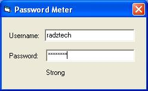



## password meter

### Description

This password meter is based from the algorithm by Phiras with a few tweaks of my own

You can view the algorithm here

http://phiras.wordpress.com/2007/04/08/password-strength-meter-a-jquery-plugin/
 
### More Info
 
User inputs the username and the password

Strength of the password

             |
---                |---
**Submitted On**   |2008-07-05 17:48:48
**By**             |[Radztech](https://github.com/Planet-Source-Code/PSCIndex/blob/master/ByAuthor/radztech.md)
**Level**          |Beginner
**User Rating**    |4.7 (14 globes from 3 users)
**Compatibility**  |VB 6\.0
**Category**       |[Miscellaneous](https://github.com/Planet-Source-Code/PSCIndex/blob/master/ByCategory/miscellaneous__1-1.md)
**World**          |[Visual Basic](https://github.com/Planet-Source-Code/PSCIndex/blob/master/ByWorld/visual-basic.md)
**Archive File**   |[password\_m211946752008\.zip](https://github.com/Planet-Source-Code/radztech-password-meter__1-70784/archive/master.zip)

